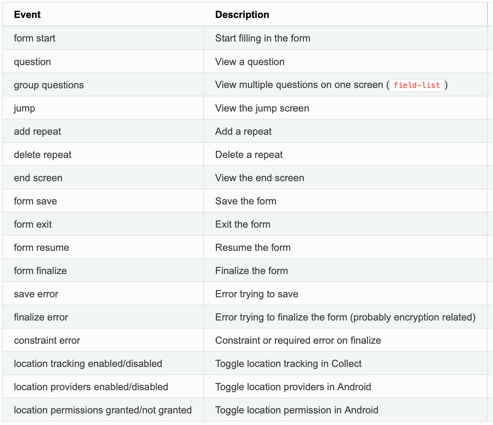
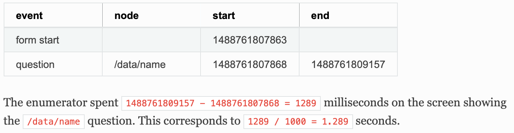

```{r setup, include=FALSE}
knitr::opts_chunk$set(echo = FALSE)
```

```{r global_options, include=FALSE}
knitr::opts_chunk$set(warning=FALSE, message=FALSE)
```

```{r, include=FALSE}
if (!require("pacman")) install.packages("pacman")
pacman::p_load(tidyverse, DT, readxl, anytime, cluster)

source("./utils.R")

#------------------------------------------------------------------------------------
# INPUT THE FOLLOWING PARAMETERS FOR EACH ASSESSMENT
#------------------------------------------------------------------------------------
# specify assessment name
assessment.name <- "KAP NES"
# specify column names of UUID and enumerator-code as they are in the survey dataset
uuid.column.name <- "_uuid"
enumerator.column.name <- "1.1 Enter enumerator name / code:"
#------------------------------------------------------------------------------------

# load all audit files
directory.audits <- "data/audit/"
audit <- load.audit.files(directory.audits)

# load survey data
directory.survey.data <- "data/survey_data/"
survey.data <- load.survey.data(directory.survey.data, uuid.column.name, enumerator.column.name)
```

# {.tabset}

## Report

### Assessment details

Assessment name: *`r assessment.name`*

Number of audit logs loaded: *`r length(unique(audit$uuid))`*

---

### Summary of paradata for each survey

```{r}
summary.general <- get.summary.general(audit) %>% 
  left_join(survey.data, by="uuid")

summary.general.pivot <- summary.general %>% 
  pivot_wider(data = ., names_from = event, values_from = n, values_fill = 0) %>% 
  mutate(survey.response.time=round(survey.response.time/60, 1),
         survey.duration=round(survey.duration/60, 1)) %>% 
  select(-c(question, num.unique.nodes))

datatable(summary.general.pivot, 
          caption="List of all surveys with summary of audit events. Survey duration and response time are in minutes.", 
          options = list(scrollX=TRUE, pageLength = 5))
```

---

### Average statistics per enumerator

```{r}
enum.view <- summary.general %>% 
  group_by(enum) %>% mutate(num.surveys=length(unique(uuid))) %>% 
  group_by(enum, event) %>% summarise(num.surveys=num.surveys[1], avg=round(sum(n)/num.surveys, 1)) %>% 
  pivot_wider(names_from="event", values_from="avg", values_fill=0) %>% 
  mutate(survey.response.time=round(survey.response.time/60, 1),
         survey.duration=round(survey.duration/60, 1)) %>% 
  arrange(-num.surveys)

cols <- c("num.surveys", "form.resume", "jump", 
          "num.unique.questions", "avg.edits.per.question",
          "survey.response.time", "survey.duration")
cols.intersect <- intersect(cols, colnames(enum.view))

datatable(enum.view %>% select("enum", all_of(cols.intersect)),
          caption="Number of conducted surveys, average number of events, average survey response time and duration in minutes per enumerator", 
          options = list(scrollX=TRUE, pageLength = 10))
```

---

### Average question response time per enumerator

```{r}
stats.question.uuid <- audit %>% filter(node!="") %>%
  group_by(uuid, question) %>% summarise(duration=sum(duration, na.rm=TRUE)) %>% 
  left_join(survey.data, by="uuid")

stats.question <- stats.question.uuid %>% 
  group_by(enum) %>% mutate(num.surveys=length(unique(uuid))) %>% 
  group_by(enum, question) %>% summarise(num.surveys=num.surveys[1], avg.response.time=round(mean(duration), 1)) %>% 
  pivot_wider(names_from="question", values_from="avg.response.time", values_fill=0) %>% 
  arrange(-num.surveys)

cols.sorted <- c("enum", "num.surveys", sort(colnames(stats.question)[3:length(colnames(stats.question))]))
datatable(stats.question %>% select(all_of(cols.sorted)),
          caption="Average question response time in seconds per enumerator", 
          options = list(scrollX=TRUE, pageLength = 10))
```


---

### Anomaly score

In this section we calculate an anomaly score between 0 and 1 for each enumerator which can help to detect irregular behaviours. Scores above 0.2 should be further investigated. The anomaly score is calculated as the average of two components:

* The *deviation.score* [0-1] indicates how much the average response time of the surveys from one enumerator deviates from the overall median response time of all surveys. A low score indicates that the average response time for the enumerator is close to the overall median response time. While, a high score indicates that the average response time for the enumerator is either much higher or much lower than the overall median response time. The deviation.score is calculated for each question  and then averaged.

* The *gower.score* [0-1] indicates how much the enumerator interaction with Kobo deviates from a regular behaviour. Particular focus is on the number of occurences of *form.resume*, *jump*, *constraint.error* and on the *survey.response.time*, *num.unique.questions*, and *avg.edits.per.question*. Once again, a low value indicates a regular interaction while a high value indicates an irregular one (e.g. high number of jumps or avg.edits.per.question). The gower.score is calculated for each survey and then averaged for each enumerator.

```{r}
## DEVIATION FROM MEDIAN RESPONSE TIME
get.anomaly.score <- function(distr, value){
  exp.factor <- 5
  quantile <- sum(sort(distr) < value)/length(distr)
  distance.from.median <- abs(quantile-0.5)
  score <- distance.from.median^exp.factor / 0.5^exp.factor
  return(score)
}

stats.question.uuid <- audit %>% filter(node!="") %>%
  group_by(uuid, question) %>% summarise(duration=sum(duration, na.rm=TRUE)) %>% 
  left_join(survey.data, by="uuid")

stats.enum <- stats.question.uuid %>% 
  group_by(question) %>% mutate(distr=list(duration)) %>% 
  group_by(enum) %>% mutate(num.surveys=length(unique(uuid))) %>% 
  group_by(enum, question) %>% summarise(num.surveys=num.surveys[1],
                                         mean.rt=mean(duration),
                                         distr=distr[1])
stats.enum[["anomaly.score"]] <- apply(stats.enum, 1, function(x) get.anomaly.score(x$distr, x$mean.rt))
stats.enum <- stats.enum %>% 
  group_by(enum) %>% summarise(num.surveys=num.surveys[1], deviation.score=round(mean(anomaly.score), 2))

## DEVIATON FROM REGULAR KOBO INTERACTIONS
cols <- c("end.screen", "form.exit", "form.finalize", "form.save", 
          "form.start", "form.resume", "jump", "constraint.error", 
          "survey.duration", "survey.response.time", "num.unique.questions", "avg.edits.per.question")
is.cols.present <- cols %in% colnames(summary.general.pivot)
cols <- cols[is.cols.present]
weights <- c(1,1,1,1, 1,3,3,3, 1,3,3,3)
weights <- weights[is.cols.present]

s <- summary.general.pivot %>% pivot_longer(cols=all_of(cols), names_to="event", values_to="n") %>% 
  group_by(event) %>% summarise(uuid="MEDIAN", enum="MEDIAN", median=median(n)) %>% 
  pivot_wider(data = ., names_from = event, values_from = median, values_fill = 0)

all <- rbind(select(summary.general.pivot, c("uuid", "enum", cols)), s)
ref.idx <- which(all$uuid=="MEDIAN")

gower_dist <- daisy(all[, -(1:2)], metric = "gower", weights=weights)
gower_mat <- as.matrix(gower_dist)

all[["gower.dist"]] <- gower_mat[ref.idx, ]

all.enum <- all %>% filter(enum!="MEDIAN") %>% group_by(enum) %>% summarise(gower.score = round(mean(gower.dist), 2))

## COMBINED ANOMALY SCORE
j <- left_join(stats.enum, all.enum, by="enum") %>% mutate(anomaly.score=round((deviation.score+gower.score)/2, 2))
datatable(arrange(j, -anomaly.score),
          caption="Anomaly score based on deviation from median response time and regular Kobo interaction", 
          options = list(scrollX=TRUE, pageLength = 10))
```


---

### Question response time from all surveys

```{r}
stats.question.uuid <- audit %>% filter(node!="") %>%
  group_by(uuid, question) %>% summarise(response.time=sum(duration, na.rm=TRUE)) %>% 
  group_by(question) %>% summarise(num.responses=n(),
                                   median.response.time=round(median(response.time, na.rm=TRUE), 2),
                                   min.response.time=round(min(response.time, na.rm=TRUE), 2),
                                   max.response.time=round(max(response.time, na.rm=TRUE), 2))
datatable(stats.question.uuid,
          caption="Median, minimum and maximum values of question response time in seconds", 
          options = list(scrollX=TRUE, pageLength = 10))
```

---

### Histogram of survey response time

```{r, fig.height = 4, fig.width = 10, echo=FALSE}
ggplot(summary.general.pivot, aes(x=survey.response.time)) +
  geom_histogram(bins=max(summary.general.pivot$survey.response.time)/5) +
  xlab("Survey response time [minutes]") + ylab("Number of surveys")
```

---

### Survey start time distribution

**Warning:** contrary to the response time, that does not depend on the absolute device time since it is calculated as the elapsed time between 2 events, the start time of the survey is the actual timestamp reported by the device for the event *form.start*. Thus, it could be inaccurate if the device time is not set correctly. The following histograms could be affected by this fact.

```{r}
a <- audit %>% filter(event=="form.start") %>% 
  mutate(date=anytime(start/1000, tz="Asia/Damascus")) %>%
  select(start, date) %>% 
  mutate(time=hms::as_hms(as.numeric(str_sub(date, 12, 13))*3600 + 
                            as.numeric(str_sub(date, 15, 16))*60 +
                            as.numeric(str_sub(date, 18, 19))))
```

#### By date and time

```{r, fig.height = 4, fig.width = 10, echo=FALSE}
ggplot(a, aes(x=date)) + geom_histogram(bins=50) + ylab("Number of surveys")
```

#### By time

```{r, fig.height = 4, fig.width = 10, echo=FALSE}
ggplot(a, aes(x=time)) + geom_histogram(bins=50) + ylab("Number of surveys")
```

## Definitions

Detailed information about audit logging can be found [here](https://docs.getodk.org/form-audit-log/).

### Event types

{#id .class width=65%}

### Example

{#id .class width=65%}

### Ad-hoc definitions

* survey.duration = time from *form start* to the last *form exit* (it can be days later in some cases).

* survey.response.time = sum of the time spent on the screen showing any of the questions (events: *question* and *group questions*).

* num.unique.questions = number of unique questions that were shown on the screen during the survey.

* avg.edits.per.question = average number of times a question was opened during the survey. It is calculated as the ratio between the total number of questions opened and the number of unique questions.